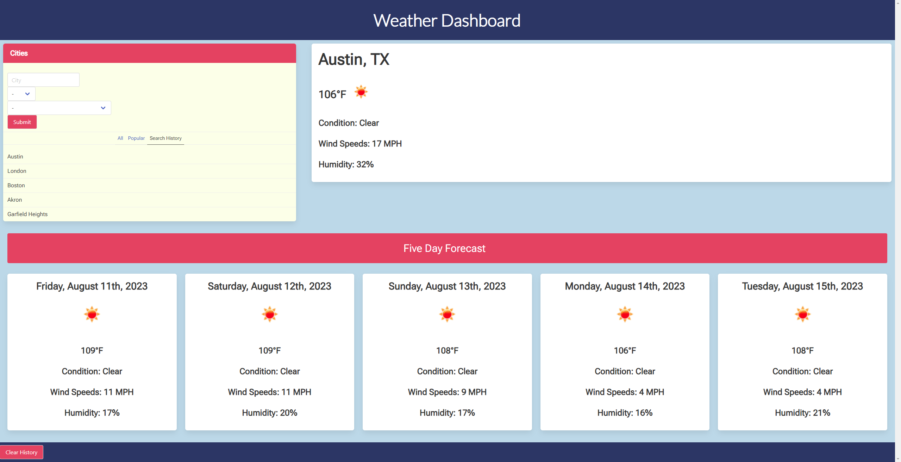

# CWRU Bootcamp Challenge 6 - Weather Dashboard

## Description

1. In this challenge, my main goal was to create a weather dashboard, that allows users to search cities using the OpenWeather API to display current weather and a five day forecast to the webpage! After making a search, the previous searches would be saved locally to a search history and upon clicking a previous entry, the weather data would be retrieved again.

2. This was a way for to revisit concepts we went over in class previously such as saving/retrieving information from a JSON, event handlers, event listeners etc. but with the added integration of the OpenWeather API.

3. For this project specifically, I used Bulma CSS framework to layout the page. I wanted to try out a new framework other than bootstrap to broaden my horizons, so I learned a lot about column layouts and other components during this process.

4. While I did use a standard input box for the city input, I chose to use a Bulma control select for both the state and country selection. It was really neat getting to see behind the scenes of a common selection form we see every day on other websites!

5. Having different menus become active with adding and removing classes was neat exploration, and setting up the different menus so they would show different sets of information felt like one of the most rewarding parts of this experience.

## Installation and Usage

Simply use the download all of the files provided and open the index.html in your file viewer of choice!
To look at the source code, open it, the CSS file and the Javascript file in a text file editor of choice!

## Mockup:
The following images shows the web application's appearance and functionality:
<figure>
    
    <figcaption style="font-weight:500;">This is an example of the webpage showing the weather information for Austin, Texas. The search history tab is selected, and will only show the 5 most recent searches.</figcaption>
</figure>

<figure>
    
    <figcaption style="font-weight:500;">This is an example of the webpage showing the weather information for Austin, Texas again. However, this time the all tab is selected, which will show ALL the previous searches done on the page. (excluding repeat searches)</figcaption>
</figure>

## Credits
 
 Editing of code done by myself, <b>Anthony Iacano</b>
  
 Powered by the <b>OpenWeather API ® All rights reserved</b>
  
 Lesson provided by <b>edX Boot Camps LLC.</b>

## Link to Deployed Page

 https://anthony-gg.github.io/weather-dashboard/

 ## License

Please reference the **LICENSE.MD** file inside of the repository.

---